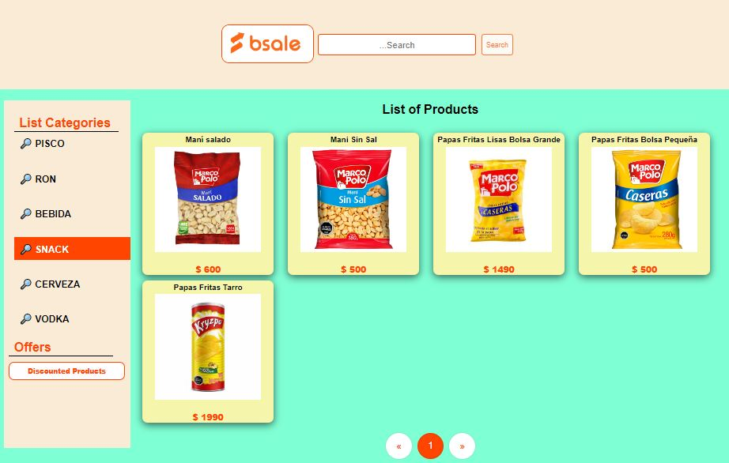
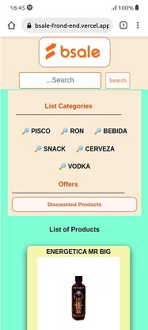

# Bsale test  Website


# Bsale test  Website Responsive


## Demo Website

- 👉 Vercel : [https://bsale-frond-end.vercel.app](https://bsale-frond-end.vercel.app/)


## Technologies

- HTML5 and CSS3: Semantic Elements, CSS Grid, Flexbox
- JavaScript: ES6+, Array Functions,
- Development: Git, Github,
- Deployment: Vercel

## Run Locally

### 1. Clone repo

```
$ git https://github.com/jhonntantb/Bsale-Frond-End.git
$ cd Bsale-Frond-End
```


### 2. Run Frontend

```
$ install Live server in code editor
$ run file index.html
```


### 3. Support

- Contact Developer [Jhonntan](mailto:Jhonntan.jhonntantb@gmail.com)